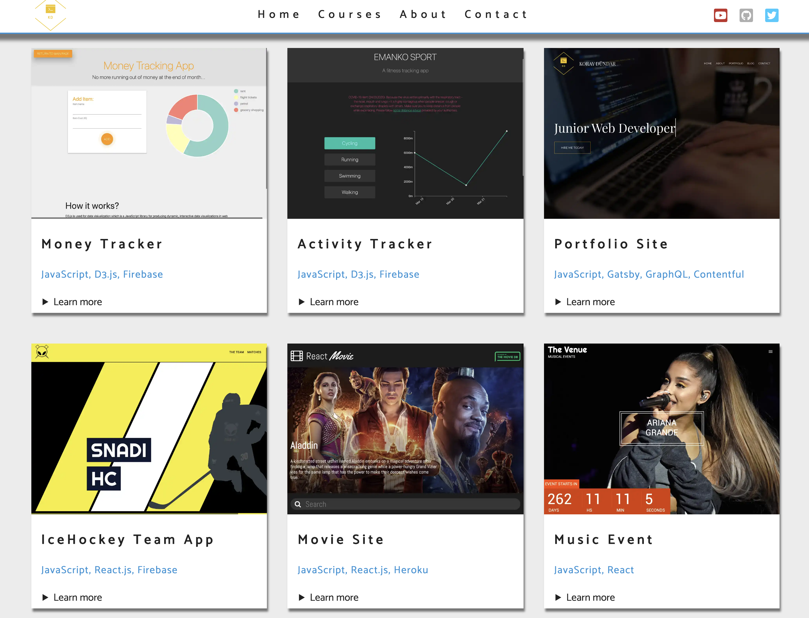

# Practicing Strapi - Built with Gatsby, GraphQL and Strapi

The main purpose of building this site was to learn about Strapi headles content management and to recall my knowledge about Gatsby and GraphQL. Basicly all content is stored in Strapi and I am receiving this context with GraphQL and rendering in Gatsby.

# Demo
Click the link below to see the site.  
[netlify](https://brave-turing-ccba0d.netlify.com/)
 
# Preview

# Technologies
  * Gatsby
  * Strapi
  * CSS Modules
  * GraphQL

# Author

Koray Dündar
